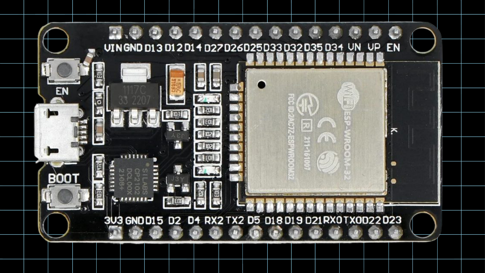
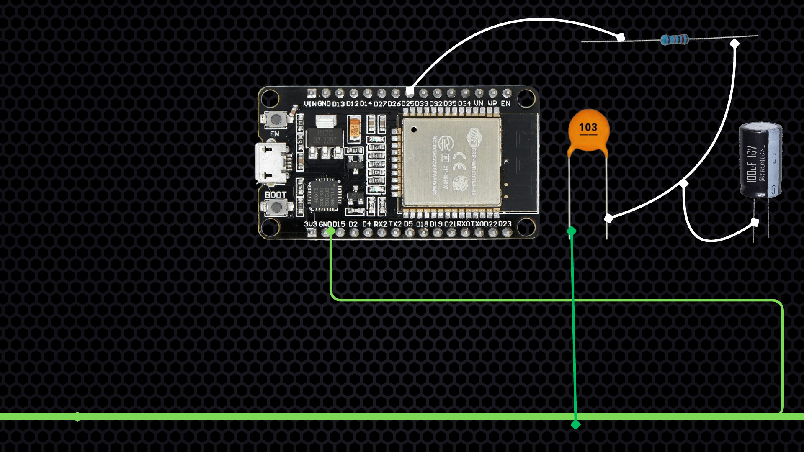
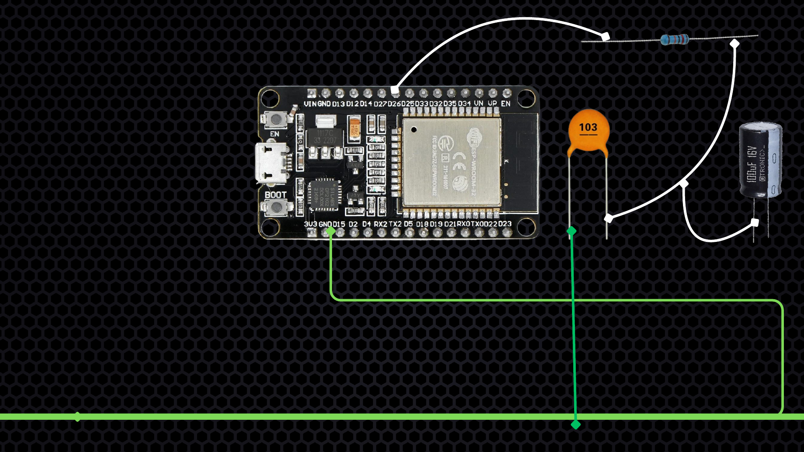
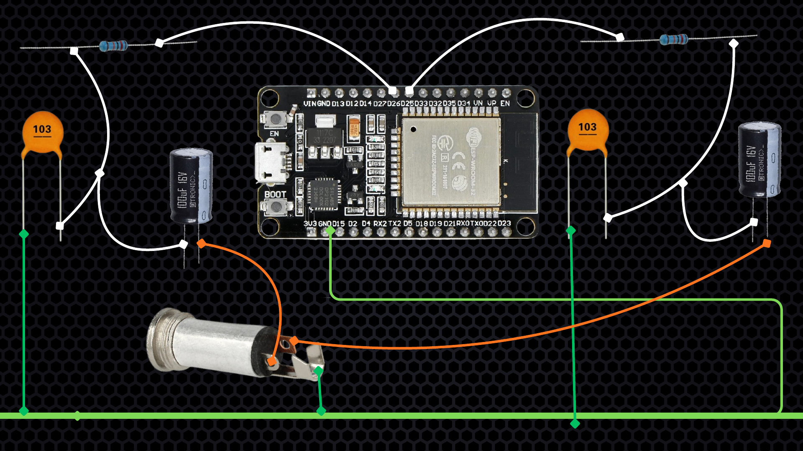
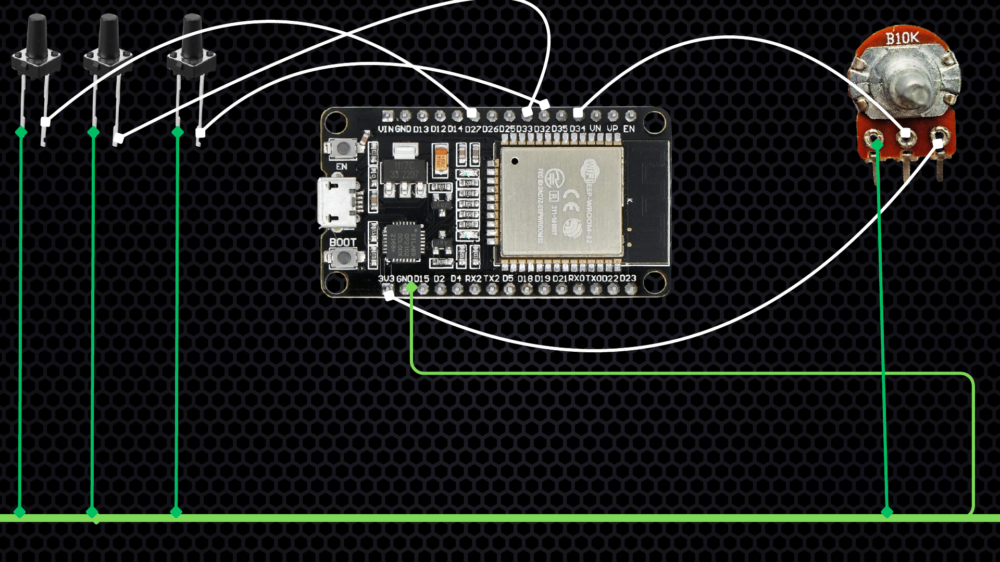

# توصيل مشروع الراديو

نفّذ كل التوصيلات والـESP32 والسماعة مفصولان من الكهرباء. المشروع يستخدم مدخل **AUX في سماعة Active**، ولا يُوصل بمكبر صوت خام مباشرة.

## القطع

- ESP32-WROOM-32 الكلاسيكية 30-pin.
- سماعة Active بمدخل AUX.
- سوكت أو كابل 3.5mm يحتوي `L` و`R` و`GND`.
- مقاومتان `1kΩ`، واحدة لكل قناة.
- مكثفان سيراميك `10nF`، واحد لكل قناة.
- مكثفان إلكتروليتي `100µF`، واحد لكل قناة.
- ثلاثة أزرار ضغط لحظية.
- مقاومة متغيرة `10K` للتحكم في الصوت.

## قناة الصوت الشمال

1. وصل `GPIO25` بطرف مقاومة `1kΩ`.
2. الطرف الآخر للمقاومة هو نقطة إشارة القناة الشمال.
3. وصل مكثف `10nF` بين نقطة الإشارة و`GND`. ليس له قطبية.
4. وصل موجب مكثف `100µF` بنفس نقطة الإشارة.
5. وصل سالب مكثف `100µF`، الناحية ذات الشريط، بطرف `L` في AUX.

## قناة الصوت اليمين

1. وصل `GPIO26` بطرف مقاومة `1kΩ` أخرى.
2. الطرف الآخر للمقاومة هو نقطة إشارة القناة اليمين.
3. وصل مكثف `10nF` آخر بين نقطة الإشارة و`GND`.
4. وصل موجب مكثف `100µF` آخر بنفس نقطة الإشارة.
5. وصل سالب مكثف `100µF` بطرف `R` في AUX.

لا تشارك المقاومة أو المكثفات بين القناتين؛ لكل قناة دائرتها المستقلة.

## أرضي الصوت

- اجمع `AUX GND` وأرضي مكثفي `10nF` في نقطة صوت واحدة قصيرة.
- أوصل من هذه النقطة سلكًا واحدًا قصيرًا إلى `GND` في ESP32.
- أبعد أسلاك الصوت عن هوائي ESP32 وكابل USB وأسلاك الأزرار.
- لا تخمّن أرجل سوكت AUX غير المكتوب عليه؛ حدد `Tip/Left` و`Ring/Right` و`Sleeve/GND` بالأفوميتر.

## الأزرار

- زر المحطة السابقة: بين `GPIO32` و`GND`.
- زر التشغيل والإيقاف المؤقت: بين `GPIO33` و`GND`.
- زر المحطة التالية: بين `GPIO27` و`GND`.

الكود يفعّل المقاومة الداخلية `INPUT_PULLUP`، لذلك لا تحتاج مقاومات خارجية للأزرار. في الزر ذي الأربع أرجل استخدم رجلًا من ناحية ورجلًا من الناحية المقابلة.

## مقاومة الصوت المتغيرة

- الرجل الوسطى إلى `GPIO34`.
- رجل خارجية إلى `3.3V`.
- الرجل الخارجية الأخرى إلى `GND`.
- إذا كان اتجاه الزيادة معكوسًا، بدّل الرجلين الخارجيتين فقط.
- لا توصل `5V` إلى `GPIO34`.

## وظيفة التحكم

- ضغطة `GPIO32`: المحطة السابقة.
- ضغطة `GPIO27`: المحطة التالية.
- ضغطة `GPIO33`: Pause أو Resume.
- ضغط `GPIO32` و`GPIO27` معًا لمدة أربع ثوانٍ: فتح بوابة إعداد Wi-Fi.

## فحص قبل التشغيل

- المقاومة الخاصة بالشمال تبدأ من `GPIO25` وتنتهي عبر المكثف عند `AUX L`.
- المقاومة الخاصة باليمين تبدأ من `GPIO26` وتنتهي عبر المكثف عند `AUX R`.
- شريط السالب في مكثفي `100µF` ناحية AUX.
- كل نقاط الأرضي مشتركة، لكن سلك أرضي الصوت قصير ومنظم.
- لا يوجد خرج قدرة من السماعة متصل بأي GPIO.
- ابدأ بصوت السماعة منخفضًا ثم ارفعه تدريجيًا.

يمكنك تنزيل ملف الصور الأصلي كاملًا من [connection.pdf](connection.pdf).
